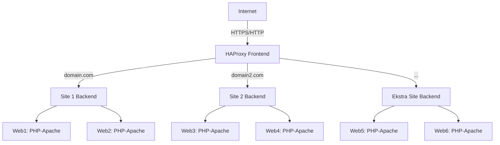

# Docker Clustered Web Architecture

Bu proje, bir veya birden fazla web sitesini yük dengeleme ile çalışan Docker ve HAProxy mimarisi üzerinde barındırmak için tasarlanmıştır. Her site bir veya daha fazla PHP-Apache konteyneri kullanabilir ve HAProxy frontend üzerinden istekleri yönlendirir. Bu yapı sayesinde yüksek erişilebilirlik, kolay ölçeklenebilirlik ve merkezi SSL yönetimi sağlanır.

---

## İçerik

- Bir veya birden fazla siteyi barındırabilir (`domain.com`, `domain2.com`, vb.)
- HAProxy ile HTTP/HTTPS load balancing
- Round-robin veya diğer load balancing algoritmaları
- SSL sertifikaları ile merkezi HTTPS desteği
- Docker Compose ile kolay kurulum ve yönetim
- Web containerlarının sağlık kontrolü (`check`) ile yüksek erişilebilirlik
- Merkezileştirilmiş loglama ve monitoring imkanı

---

## Gereksinimler

- Docker >= 20.10
- Docker Compose >= 1.29
- HAProxy >= 2.5
- PHP-Apache image (tercihe bağlı sürüm)
- Let's Encrypt sertifikaları

---

## Kurulum

1. Depoyu klonlayın:

```bash
git clone https://github.com/ugurcomptech/docker-web-architecture/
cd docker-web-architecture
```

2. Web dosyalarını yerleştirin:

- Örnek: `/home/web/site1`, `/home/web/site2` vb.
- Her site kendi klasörü altında bağımsız olarak yönetilebilir.

3. HAProxy SSL sertifikalarını `/etc/letsencrypt/live/` dizinine yerleştirin ve `haproxy.pem` olarak birleştirin:

```bash
cat fullchain.pem privkey.pem > /etc/letsencrypt/live/domain.com/haproxy.pem
cat fullchain.pem privkey.pem > /etc/letsencrypt/live/domain2.com/haproxy.pem
```

4. Docker Compose ile projeyi başlatın:

```bash
docker-compose up -d
```

5. HAProxy container'ını başlatın (ayrı bir container veya host üzerinde):

```bash
haproxy -f /haproxy/haproxy.cfg
```

---

## HAProxy Yapılandırması

- **Frontend:**
  - HTTP ve HTTPS isteklerini dinler
  - Domain bazlı ACL ile hangi backend'e yönlendirileceğini belirler
- **Backend:**
  - Round-robin load balancing ile yükü konteynerlar arasında dağıtır
  - Web containerlarının durumunu kontrol eder (`check`) ve arızalı containerları devre dışı bırakır
- **SSL Termination:** HAProxy frontend üzerinden merkezi SSL yönetimi sağlar
- **Loglama:** Syslog üzerinden container ve istek logları toplanabilir

> İstediğiniz kadar backend ekleyerek yeni siteler yayınlayabilirsiniz.

---

## Docker Compose Servisleri

- Her site için bir veya daha fazla PHP-Apache konteyneri oluşturabilirsiniz
- Konteynerlar `webnet` ağı üzerinden iletişim kurar
- Containerlar bağımsız olarak ölçeklenebilir ve güncellenebilir
- Healthcheck ile HAProxy backend’e otomatik olarak yansır

---

## Mimari



---

## Teknik Detaylar

- HAProxy `frontend` ve `backend` ACL ile domain bazlı yönlendirme sağlar
- SSL termination ile HTTPS trafiği yönetilir ve backend üzerinde HTTP kullanılır
- PHP-Apache konteynerları volume ile host üzerinde yönetilen dosyalara bağlanır
- Round-robin load balancing ile eşit dağılım sağlanır, isteğe göre `leastconn` gibi algoritmalar da uygulanabilir
- Healthcheck sayesinde bir konteyner çökerse HAProxy otomatik olarak devre dışı bırakır
- Network bridge ile konteynerler izole ama iletişim halinde çalışır

---

## Kullanım

- Web sitelerine erişim örneği:

```
https://domain.com
https://domain2.com
```

- Konteynerlerin durumunu kontrol etmek için:

```bash
docker ps
```

- Logları görüntülemek için:

```bash
docker-compose logs -f
```

- Yeni bir site eklemek için:
  1. Web dosyalarını yerleştirin
  2. Docker Compose servisini oluşturun
  3. HAProxy backend ve ACL ekleyin

---


