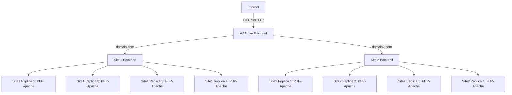

# Docker Clustered Web Architecture

Bu proje, bir veya birden fazla web sitesini **Docker ve HAProxy tabanlı yük dengeleme mimarisi** ile çalıştırmak için tasarlanmıştır. Her site bir veya birden fazla PHP-Apache konteyneri ile çalışabilir ve HAProxy frontend üzerinden istekleri yönlendirir. Bu yapı sayesinde **yüksek erişilebilirlik, kolay ölçeklenebilirlik ve merkezi SSL yönetimi** sağlanır.

---

## İçerik

- Bir veya birden fazla siteyi barındırabilir (`domain.com`, `domain2.com` vb.)  
- HAProxy ile HTTP/HTTPS load balancing  
- Round-robin veya diğer load balancing algoritmaları  
- SSL sertifikaları ile merkezi HTTPS desteği  
- Docker Compose ile kolay kurulum ve yönetim  
- Web containerlarının sağlık kontrolü (`healthcheck`) ile yüksek erişilebilirlik  
- Merkezi loglama ve monitoring imkanı  
- Replica ve deploy ile konteyner ölçeklendirme  

---

## Gereksinimler

- Docker >= 20.10  
- Docker Compose >= 1.29  
- HAProxy >= 2.5  
- PHP-Apache image (tercihe bağlı sürüm)  
- Let's Encrypt sertifikaları  

---

## Kurulum

1. Depoyu klonlayın:

```bash
git clone https://github.com/ugurcomptech/docker-web-architecture/
cd docker-web-architecture
```

2. Web dosyalarını yerleştirin:

- Örnek: `/home/web/site1`, `/home/web/site2`  
- Her site kendi klasörü altında bağımsız olarak yönetilebilir.

3. HAProxy SSL sertifikalarını `/etc/letsencrypt/live/` dizinine yerleştirin ve `haproxy.pem` olarak birleştirin:

```bash
cat fullchain.pem privkey.pem > /etc/letsencrypt/live/domain.com/haproxy.pem
cat fullchain.pem privkey.pem > /etc/letsencrypt/live/domain2.com/haproxy.pem
```

4. Docker Compose ile projeyi başlatın:

```bash
docker-compose up -d
```

---

## Docker Compose Özellikleri

- **Deploy & Replicas:** Her site için birden fazla PHP-Apache konteyneri çalıştırabilirsiniz. Örneğin:

```yaml
deploy:
  replicas: 4
```

- **Healthcheck:** Konteynerların çalışıp çalışmadığını HAProxy’ye bildirir ve arızalı containerları devre dışı bırakır:

```yaml
healthcheck:
  test: ["CMD", "curl", "-f", "http://localhost/"]
  interval: 30s
  timeout: 10s
  retries: 3
  start_period: 20s
```

- **Ortak Konfigürasyon (Anchor):** Tekrar eden PHP-Apache ayarları `x-php-common` ile tanımlanır ve her site container’ında kullanılır:

```yaml
x-php-common: &php-common
  image: php:8.2-apache
  mem_limit: 512m
  cpus: 0.5
  environment:
    PHP_OPCACHE_ENABLE: 1
    ...
```

- **Loglama:** JSON formatında merkezi loglama ve dosya boyutu sınırı (`max-size`) ile log yönetimi  

---

## HAProxy Yapılandırması

- **Frontend:** HTTP ve HTTPS isteklerini dinler, domain bazlı ACL ile backend’e yönlendirir  
- **Backend:** Replica konteynerları arasında round-robin ile yük dağıtır  
- **SSL Termination:** Frontend üzerinde SSL yönetimi sağlar  
- **Loglama:** Syslog üzerinden container ve istek logları toplanabilir  

---

## Mimari (Replica Uyumlu)



- Her backend, Docker Compose deploy’da tanımlanan **replica sayısı** kadar PHP-Apache konteynerine sahiptir.  
- HAProxy, **healthcheck** ile arızalı replica’ları otomatik olarak devre dışı bırakır.  

---

## Kullanım

- Web sitelerine erişim örneği:

```
https://domain.com
https://domain2.com
```

- Konteynerlerin durumunu kontrol etmek için:

```bash
docker ps
```

- Logları görüntülemek için:

```bash
docker-compose logs -f
```

- Yeni bir site eklemek için:
  1. Web dosyalarını yerleştirin  
  2. Docker Compose servisini oluşturun  
  3. HAProxy backend ve ACL ekleyin  
  4. Gerekirse deploy replicas sayısını artırın

