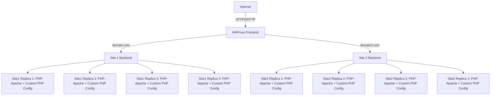

# Docker Clustered Web Architecture

Bu proje, bir veya birden fazla web sitesini **Docker ve HAProxy tabanlı yük dengeleme mimarisi** ile çalıştırmak için tasarlanmıştır. Her site bir veya birden fazla PHP-Apache konteyneri ile çalışabilir ve HAProxy frontend üzerinden istekleri yönlendirir. Bu yapı sayesinde **yüksek erişilebilirlik, kolay ölçeklenebilirlik, merkezi SSL yönetimi ve özelleştirilebilir PHP ayarları** sağlanır.

---

## İçerik

- Bir veya birden fazla siteyi barındırabilir (`domain.com`, `domain2.com` vb.)  
- HAProxy ile HTTP/HTTPS load balancing  
- Round-robin veya diğer load balancing algoritmaları  
- SSL sertifikaları ile merkezi HTTPS desteği (otomatik veya manuel)  
- Docker Compose ile kolay kurulum ve yönetim  
- Web containerlarının sağlık kontrolü (`healthcheck`) ile yüksek erişilebilirlik  
- Merkezi loglama ve monitoring imkanı  
- Replica ve deploy ile konteyner ölçeklendirme  
- **Custom PHP Config:** Her site için ayrı `php.ini` dosyası ile PHP ayarlarını özelleştirme imkanı

---

## Gereksinimler

- Docker >= 20.10  
- Docker Compose >= 1.29  
- HAProxy >= 2.5  
- PHP-Apache image (tercihe bağlı sürüm)  
- Let's Encrypt sertifikaları (opsiyonel, otomatik SSL için)  

---

## Kurulum

1. Depoyu klonlayın:

```bash
git clone https://github.com/ugurcomptech/docker-web-architecture/
cd docker-web-architecture
```

2. Web dosyalarını yerleştirin:

- Örnek: `/home/web/site1`, `/home/web/site2`  
- Her site kendi klasörü altında bağımsız olarak yönetilebilir.

3. **Custom PHP Config** oluşturun:

```bash
mkdir -p php-config/site1
mkdir -p php-config/site2
nano php-config/site1/php.ini  # site1 için PHP ayarları
nano php-config/site2/php.ini  # site2 için PHP ayarları
```

Örnek php.ini içeriği:

```ini
memory_limit = 512M
upload_max_filesize = 100M
post_max_size = 120M
max_execution_time = 120
date.timezone = Europe/Istanbul
opcache.enable = 1
opcache.memory_consumption = 128
opcache.interned_strings_buffer = 16
opcache.max_accelerated_files = 10000
opcache.validate_timestamps = 0
log_errors = On
error_log = /var/log/php_errors.log
display_errors = Off
```

4. HAProxy SSL sertifikalarını ekleyin (manuel kullanıyorsanız):

```bash
cat fullchain.pem privkey.pem > /etc/letsencrypt/live/domain.com/haproxy.pem
cat fullchain.pem privkey.pem > /etc/letsencrypt/live/domain2.com/haproxy.pem
```

5. Docker Compose ile projeyi başlatın:

```bash
docker-compose up -d
```

- Eğer otomatik SSL kullanıyorsanız `certbot` servisi sertifikaları kendisi alır ve `./certs` dizinine yerleştirir.

---

## Docker Compose Özellikleri

- **Deploy & Replicas:** Her site için birden fazla PHP-Apache konteyneri çalıştırabilirsiniz. Örneğin:

```yaml
deploy:
  replicas: 4
```

- **Healthcheck:** Konteynerların çalışıp çalışmadığını HAProxy’ye bildirir ve arızalı containerları devre dışı bırakır:

```yaml
healthcheck:
  test: ["CMD", "curl", "-f", "http://localhost/ || exit 1"]
  interval: 30s
  timeout: 10s
  retries: 3
```

- **Ortak Konfigürasyon (Anchor):** Tekrar eden PHP-Apache ayarları `x-php-common` ile tanımlanır ve her site container’ında kullanılır.

- **Custom PHP Config:** Her site için özel `php.ini` dosyası mount edilebilir:

```yaml
volumes:
  - ./php-config/site1/php.ini:/usr/local/etc/php/conf.d/custom.ini:ro
```

- **Loglama:** JSON formatında merkezi loglama ve dosya boyutu sınırı (`max-size`) ile log yönetimi.

- **Otomatik SSL:** Certbot servisleri ile HAProxy’nin kullandığı sertifikalar otomatik alınabilir ve yenilenebilir.

---

## HAProxy Yapılandırması

- **Frontend:** HTTP ve HTTPS isteklerini dinler, domain bazlı ACL ile backend’e yönlendirir  
- **Backend:** Replica konteynerları arasında round-robin ile yük dağıtır  
- **SSL Termination:** Frontend üzerinde SSL yönetimi sağlar  
- **Loglama:** Syslog üzerinden container ve istek logları toplanabilir

---

## Mimari (Replica & Custom PHP Config)



- Her backend, Docker Compose deploy’da tanımlanan **replica sayısı** kadar PHP-Apache konteynerine sahiptir.  
- HAProxy, **healthcheck** ile arızalı replica’ları otomatik olarak devre dışı bırakır.  
- Her replica, kendi **custom PHP config** dosyasını kullanabilir.

---

## Kullanım

- Web sitelerine erişim örneği:

```
https://domain.com
https://domain2.com
```

- Konteynerlerin durumunu kontrol etmek için:

```bash
docker ps
```

- Logları görüntülemek için:

```bash
docker-compose logs -f
```

- Yeni bir site eklemek için:
  1. Web dosyalarını yerleştirin  
  2. Docker Compose servisini oluşturun  
  3. HAProxy backend ve ACL ekleyin  
  4. Gerekirse deploy replicas sayısını artırın  
  5. İsteğe bağlı olarak custom PHP config dosyası ekleyin  
  6. Otomatik SSL kullanıyorsanız yeni domaini certbot servisine ekleyin

